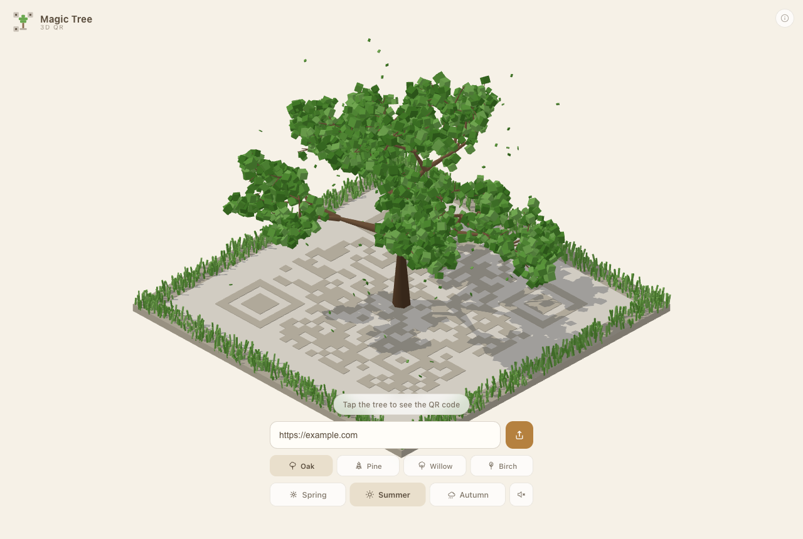
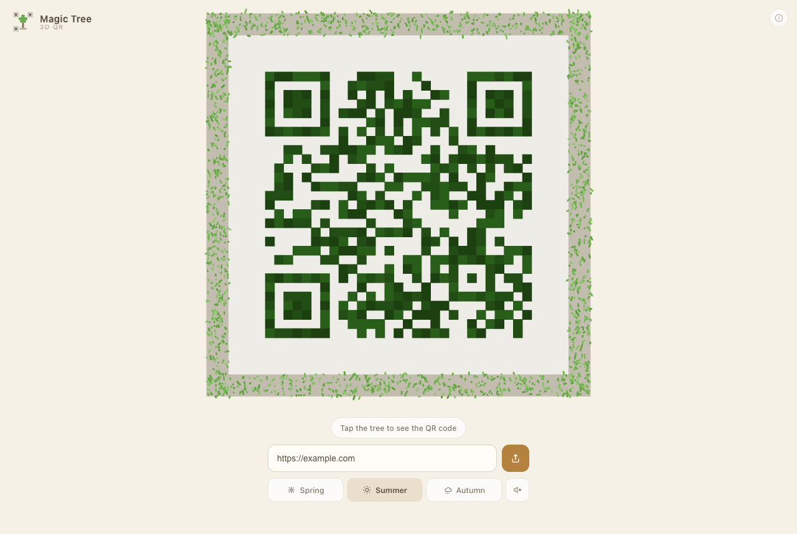
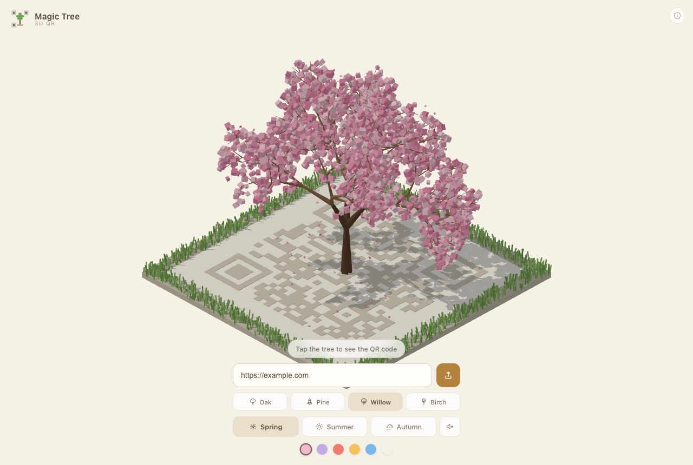
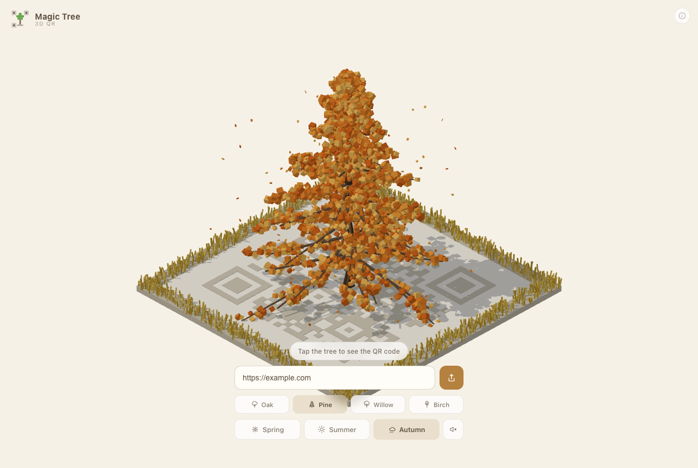

# Magic Tree

**[magic-tree-three.vercel.app](https://magic-tree-three.vercel.app)**

An isometric 3D tree whose plot **is** a scannable QR code. Tap it and the canopy
comes apart leaf by leaf, each one flying down into a module of the code below.



| Tap to reveal the code | A spring willow |
| --- | --- |
|  |  |

Type a link, pick a species and a season, and the tree regrows around it. The
result actually scans — that constraint drove most of the interesting decisions
below.

## Species

Four silhouettes, each with its own growth profile in
[`src/scene/species.ts`](src/scene/species.ts):

| | |
| --- | --- |
| **Oak** | Broad, heavy, low-slung crown. |
| **Pine** | A straight leader hung with whorls of side branches that shorten toward the tip. |
| **Willow** | Branches flatten early and hang; foliage is stretched downward. |
| **Birch** | Slender and upright, pale bark, a narrower crown. |



A conifer is not the same shape problem as a broadleaf, so it does not share the
recursion. `growConifer` builds the trunk and its whorls directly, which gives
exact control of the cone; everything else grows fractally. The two broadleaf
rings closest to the trunk are spaced evenly around the compass — left to
chance, a tree throws all its weight to one side and visibly leans.

Silhouette is finished by a post-pass. `taper` pulls the canopy in toward its
axis with height, so the outline is exact even though the branching underneath
stays organic.

## Running it locally

```bash
npm install
npm run dev
```

| Script | What it does |
| --- | --- |
| `npm run dev` | Vite dev server |
| `npm run build` | Type-check and build to `dist/` |
| `npm test` | Run the test suite |
| `npm run lint` | Lint with oxlint |

Deployed on Vercel as a static build; `vercel --prod` from the repo root
publishes it.

## How it works

### The plot is the code

There is no QR texture pasted onto the ground. The plot is an `InstancedMesh` of
one tile per module, and dark modules sit slightly proud of the light field so
the pattern reads even while the canopy is still up.

The payload is encoded at **error-correction level H** (30 % redundancy) with a
four-module quiet zone, so the code survives a canopy sitting on top of it.

### The morph

Every leaf knows two positions: where it rests on a branch, and which module it
belongs to once the code resolves. A single `morph` value in `[0, 1]` drives
everything — leaf position, scale, tumble, colour, and the camera swinging from
isometric to straight overhead.

The whole transition runs in **0.95 s**. The camera swings on an eased copy of
the morph so it does not start or stop dead, and the per-leaf stagger is kept
short — a long tail of straggling leaves is what makes a transition feel slow
even when it is technically brief.

The woody skeleton withdraws into the plot as the code resolves, shrinking
toward the trunk base and gone by the time the morph is halfway. It has to be:
leaving the branches up until the end left a trunk standing over the finished
code.

Leaves are handed out in runs of six, one run per dark module, and each run is
laid out as a flat 3×2 grid at a **uniform** height:

```
src/scene/moduleLayout.ts   →  leafTarget(qr, index)
```

That uniformity is load-bearing. An earlier version stacked leaves in two layers
and tinted each leaf independently, which left visible seams and height steps
inside every module. Cell centres still sampled correctly, but the intra-module
noise was enough to defeat a scanner's binariser. One flat layer, one tone per
module, and the codes decode.

### Keeping it scannable

Three things are tuned specifically for scanners rather than for looks:

- **Ambient light ramps up** as the code resolves (`0.62 → 2.45`) and the key
  light drops away, so light modules blow out to near-white, dark modules stay
  deep, and no shadow ever falls across the pattern.
- **The blossom palette has two tones per swatch** — a bright canopy colour and a
  much deeper `qr` colour. Pretty pinks and honeys are far too light to binarise
  against a pale plot, so they darken on the way down.
- **The grass rim sits outside the quiet zone**, never on it.

The camera fits the plot into the area *above* the control dock, so no part of
the UI can ever cover a module. It measures the dock rather than assuming a
height, so adding a row of controls cannot silently start clipping the code. The
isometric view is fitted the same way, by projecting the plot corners and the
canopy's bounding box onto the camera's screen axes — fitting to the foliage
rather than the branch tips is what stops a wide crown being cut off.

### Determinism

The tree is grown from a hash of the link, so the same URL always produces the
same tree — same branches, same leaf scatter — while a different one grows
something new.

## Tests

```bash
npm test
```

The suite covers the parts that can be checked without a GPU: QR matrix
structure and finder patterns, that every dark module receives exactly six
leaves, that no leaf ever lands on a light module or in the quiet zone, that
module blocks stay inside their own cell, that every block shares one height,
that tree growth is deterministic per seed, and that each species keeps a
distinct silhouette — a conifer really is narrower for its height than a
broadleaf, and its crown really does taper.

Scannability itself was verified in the browser by rendering the settled code and
decoding it back with [jsQR](https://github.com/cozmo/jsQR) — 64/64 across every
species, all three seasons, the blossom swatches, and codes from version 21 up
to 49.

## Stack

React 19, three.js, TypeScript, Vite. No 3D asset files — the tree, the plot, the
grass, and the falling leaves are all generated at runtime. Ambience is
synthesised with the Web Audio API rather than shipped as samples.

## Credits

An original, open-source take on the isometric QR-tree idea, inspired by
[tree.icqr.com](https://tree.icqr.com). No code, art, or branding from that site
is used here — everything in this repository was written from scratch.

## Licence

MIT — see [LICENSE](LICENSE).
